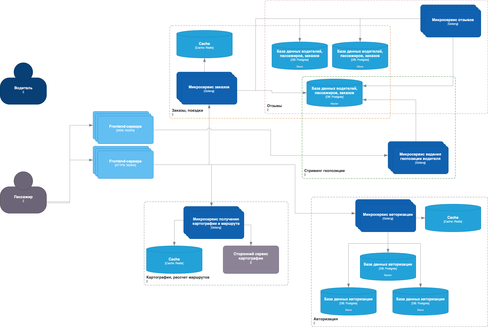

# Курсовая работа по курсу 'проектирование высоконагруженных систем' Технопарка

# Uber / Яндекс.Такси

## 1. Тема и целевая аудитория

### Целевая аудитория

* Сегменты: Несколько стран, например: Россия, Беларусь, Казахстан, Израиль, в нашем случае будем описывать локализацию 
* по России Количество активных пользователей в месяц ~ 20 млн активных пользователей в месяц
* В возрастная категория: 18-60 лет

### Ключевой функционал

* Заказ такси пользователем на карте
* Получение заказа водителем и его выполнение
* Отслеживание местоположения таксиста при заказе поездки

## 2. Расчет нагрузки

### Продуктовые метрики

Рынок такси в 2020 году соответствует рынку такси в 2018 и кол-во поездок в день ~ 7млн. Кол-во поездок в сутки в Москве 
составляет ~900тыс, при этом доля яндекса составляет 70%. В России доля яндекса составляет 27%. Отсюда следует что доля 
Яндекса по всей России ~ 42%, итого ~ 3млн поездок в день. Треть пользуется такси ~ 20 раз месяц, оставщаяся часть ~2 
раза в месяц, итого кол-во уникальных пользователей в месяц ~ 20 млн. Таким образом кол-во уникальных пользователей в 
день ~ 3 млн и около 200 тыс водителей.

### RPS

#### Расчет пути и заказ такси

Совершается каждым активным пользователем 1-2 раза в сутки. Средний rps:

`3 * 10^6 * 1.5 / 24 / 60 / 60 = 52 rps`

#### Отзыв на поездку

В среднем 50% пользователей оставляют отзывы на поездку

Совершается каждым активным пользователем два раза в сутки. Средний rps:

`3 * 10^6 * 1.5 * 0.5 / 24 / 60 / 60 = 26 rps`

#### Получение заказа таксистом

Равен количеству заказов такси. Средний rps:

`3 * 10^6 * 1.5 / 24 / 60 / 60 = 52 rps`

#### Отправка текущей геолокации водителями

200тыс водителей каждую секунду отправляют сведения о местоположении.

`200000 rps`

#### Итог

Всего rps = 205868 rps

| Заказ такси | Оценка поездки | Прием заказа | Гео        | Всего      |
|-------------|----------------|--------------|------------|------------|
| 52 rps      | 26 rps         | 52 rps       | 200000 rps | 205868 rps |

### Хранение данных

Основная сущности - пользователь, водитель, поездка, отзыв.

Количество пользователей, как говорилось выше - 20 млн, количество водителей - 200 тыс, количество поездок = (количество 
пользователей * 1.5 примерно каждый день), количество отзывов = (количество пользователей * 1.5 / 2 примерно каждый день).

### Действия пользователей

Для одного пользователя

| Заказ такси     | Оценка поездки     | Прием заказа    |
|-----------------|--------------------|-----------------|
| 1.5 раза в день | 1.5 / 2 раз в день | 1.5 раза в день |

### Сетевой трафик

Отправка геопозиции: Ширина и Долгота имеют размер в 8 байта каждый, так же передаётся id 4 байта.

`20 * 200 тыс = 4 млн байт/c или ~4 млн Мб/день.`

Остальное:

`~400 тыс Мб/день`

## 3. Логическая схема БД
Основные сущности Пользователь, Водитель, Поездка, Отзыв, Местоположение водителя


В таблице местоположения хранятся записи о координатах водителя за последние сутки.

При заказе такси фронтенд запрашивает водителей с ближайшим геохэшем к своему, который он отправляет с запросом.

Бэкенд рассчитывает карту (кэширует) и маршрут у стороннего сервиса картографии (а-ля Яндекс.Навигатор), возвращает 
карту и приблизительный маршрут со временем в пути пассажиру и потенциальным водителям.

При недоступности стороннего сервиса фронту карта и приблизительный маршрут не отдается, но сделать заказ можно 
(поиск ближайших водителей осуществляется "на месте"), планируемое время также рассчитывается самостоятельно с большой 
погрешностью. 

При приеме заказа поездки фронтенд "подписывается" на обновления координат водителя и получает их до конца поездки.

Бэкэнд в этом время тоже "подписывается" на обновления координат водителя для записи маршрута в таблицу поездки.

При ошибке в поступлении обновлений координат поездка продолжается, но на фронты не поступают геоданные. При завершении 
поездки фроненд сохраняет геопозицию устройства и пытается отправить ее на бэкенд, пока не получится.

Во время поездки фронтенд водителя ведет его по маршруту, который получает у стороннего сервиса картографии.

## 4. Физическая схема БД
Данные о пользователях, водителях и поездках имеют наибольший приоритет, потому что без них приложение потеряет ключевой 
функционал. Для хранения этих данных выбран PostgreSQL, как наиболее функциональную и надежную реляционную базу данных.

Отзывы имеют меньший приоритет, но тоже хранятся в РСУБД Postgres.

Таблицы пользователей, таблица водителей и поездок шардированы по регионам пребывания.
Каждый шард будет относиться к своей геозоне.

* Москва и Санкт-Петербург ~3
* Центральная Россия ~1
* Восточная часть ~1
* Южная часть ~1
* Северная часть ~1

Для хранения последнего местоположения водителей используется 
[PostGIS](https://habr.com/ru/post/228023/#:~:text=%D0%BB%D0%BE%D0%B3%D0%B0%D1%80%D0%B8%D1%84%D0%BC-,postgis,-PostGIS) — 
это расширение, которое значительно расширяет обработку географических объектов в РСУБД PostgreSQL.

Пример таблицы местоположений:

```
CREATE TABLE geolocation_driver (

    uid SERIAL PRIMARY KEY,
    lat DOUBLE PRECISION NOT NULL CHECK(lat > -90 and lat <= 90),
    lng DOUBLE PRECISION NOT NULL CHECK(lng > -180 and lng <= 180),
    location GEOMETRY(POINT, 4326) NOT NULL -- PostGIS geom field with SRID 4326),
    updated TIMESTAMP WITHOUT TIME ZONE DEFAULT (now() AT TIME ZONE 'utc');
)
CREATE INDEX location_idx ON location USING GIST(location);
```

Пример
Insert'a в эту таблицу
```
    INSERT INTO location(uid, lat, lng, location)
    VALUES(2,20,40,ST_SetSRID(ST_MakePoint(20, 40), 4326))
    ON CONFLICT (uid)
    DO
    UPDATE SET lat = EXCLUDED.lat, lng = EXCLUDED.lng, location = EXCLUDED.location;
```
время insert/update для 100тыс 

итого 1 шард выдерживает около 20тыс rps

Для того чтобы база выдержала такое кол-во rps воспользуемся шардированием, разобьём базу на 20 шардов.
Каждый шард будет относиться к своей геозоне.

* Москва ~4
* Центральная Россия ~1
* Восточная часть ~1
* Южная часть ~2
* Северная часть ~2

Для отказоустойчивости каждой таблицы каждый шард будет реплицирован в 1 мастер и 2 реплики,
в мастер будет происходить запись, чтение же будет из реплики, если мастрер или реплика 'падает',
на её место встаёт 2 реплика.

## 5. Выбор технологий

### Backend

Golang. Развивающийся язык программирования, со статической типизацией, асинхронный, использует удобный аналог корутин 
(горутины), язык пользуется популярностью, на рынке много программистов хорошей квалификации.

Конечный проект будет работать на микросервисной архитектуре.
Микросервисы можно поделить по предоставляемым сервисам:
 - Заказ
 - ...

Микросервисы будут развернуты с использованием системы контейнеризации Docker. В дальнейшем для удобства масштабирования 
и поддержки инфраструктуры можно использовать средства оркестрации, основанные на Kubernetes, такие как KubeSphere, OpenShift.

### Протоколы взаимодействия
Протокол связи между фронтендом устройств и бэкендом - http2 + tls1.2/1.3.
Общение между микросервисами на бэкенде будет осуществляться по протоколу gRPC, 
данные будут передаваться в формате protobuf.

Механизм подписки на события перемещения водителя использует протокол ws + tls.
Устройство водителя и клиента подключаются к общему websocket-соединению, водитель отправляет геопозицию клиенту.

### Обеспечение качества
Как на фронтенде, так и на бэкенде будут использованы статические и динамические анализаторы кода, 
интеграционные и юнит тесты. Их запуск будет автоматизирован в Gitlab CI.

Так как в проекте применяется микросервисная архитектура, необходимо установить и сконфигурировать сервисы для 
мониторинга логов, трафика и нагрузки, для трассировки запросов (стек ELK/EFK; prometheus+grafana; jaeger tracing)

При дальнейшем развитии и масштабировании имеет смысл выделит отдельного специалиста/отдельную команду для проведения
интеграционно-функциональных и нагрузочных тестирований релизов.


### Frontend

**Web client:**

Для написания веб-приложения проекта для браузеров будет использоваться фреймворк React. React является одним из 
двух распространненных среди соискателей frontend-фреймворком на linkedin (наравне с Angular'ом), React является 
лидирующим фреймворком в opensource frontend-проектах (по данным github). С помощью React также можно писать приложения 
для мобильных устройств (такой вариант не подходит для продуктивной работы, но для тестирования/MVP будет полезным).

**Android/iOS - Kotlin/Swift:**

Разработка мобильных версий приложения является доминирующей во фронтенде проекта.

В текущих реалиях возможно потребуется публикация приложения в магазинах приложений Android, альтернативных Google Play,
либо на сайте проекта. Для сведения к минимуму риска блокировки приложения на iOS требуется также приложить усилия к 
написанию хорошей мобильной версии веб-сайта (тоже React). 

### Nginx:

Будем использовать nginx для следующих целей:

 - Прокси к бэкенд-микросервисам
 - Терминирование TLS
 - Базовая авторизация
 - Балансировка нагрузки на бэкенд
 - Отдача статики, кэширование частых get-запросов

### Cache:

Кэширование в каждом микросервисе осуществляется с помощью in-memory БД Redis.
Standalone Redis способен выдерживать 60k - 80k rps, кластеры Redis будут состоять из двух нод 
(основной под нагрузкой и резервной), при недоступности одной из нод трафик переключится на другую, для поддержания ее 
в "горячем" состоянии можно развернуть cache_warmup сервис, который будет переносить ключи из нагруженной ноды на резервную.

## 6. Схема проекта



## 7. Список серверов


## Источники

* https://marketing.rbc.ru/articles/12202
* https://ru.wikipedia.org/wiki/%D0%A2%D0%B0%D0%BA%D1%81%D0%B8_%D0%B2_%D0%9C%D0%BE%D1%81%D0%BA%D0%B2%D0%B5
* https://vc.ru/transport/184077-deptrans-moskvy-dolya-yandeks-taksi-v-zakazah-za-sutki-vyrosla-do-70-8-v-noyabre-na-3-bolshe-chem-v-iyune
* https://www.vedomosti.ru/business/articles/2020/06/11/832466-yandekstaksi-vezet
* https://rg.ru/2019/10/01/rossiiane-stali-chashche-polzovatsia-uslugami-taksi.html
* https://iz.ru/876402/2019-05-08/nazvana-sredniaia-prodolzhitelnost-poezdki-na-taksi-v-moskve
* https://developers.google.com/maps/documentation/javascript/mysql-to-maps
* https://habr.com/ru/post/228023/
* https://www.codeinwp.com/blog/angular-vs-vue-vs-react/
* https://habr.com/ru/company/directum/blog/469543/
* https://www.8host.com/blog/analiz-proizvoditelnosti-servera-redis-na-ubuntu-18-04/